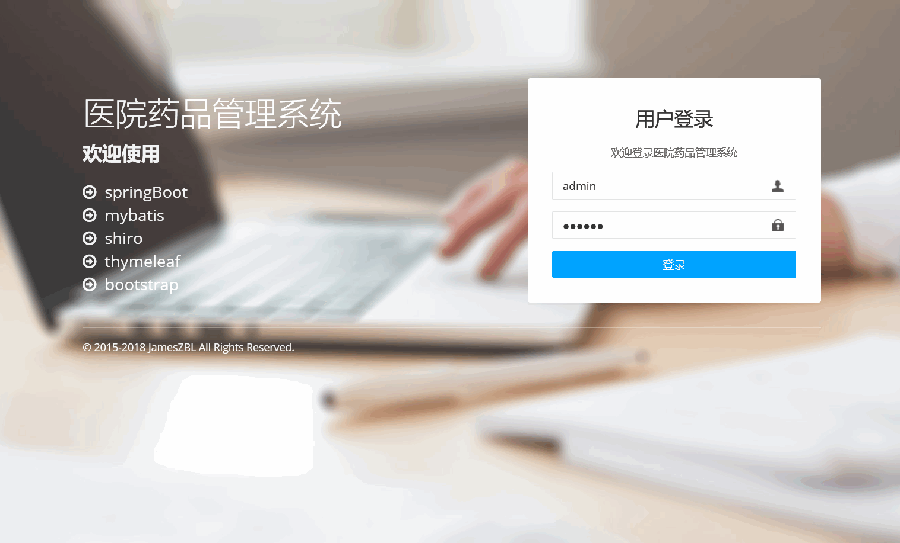
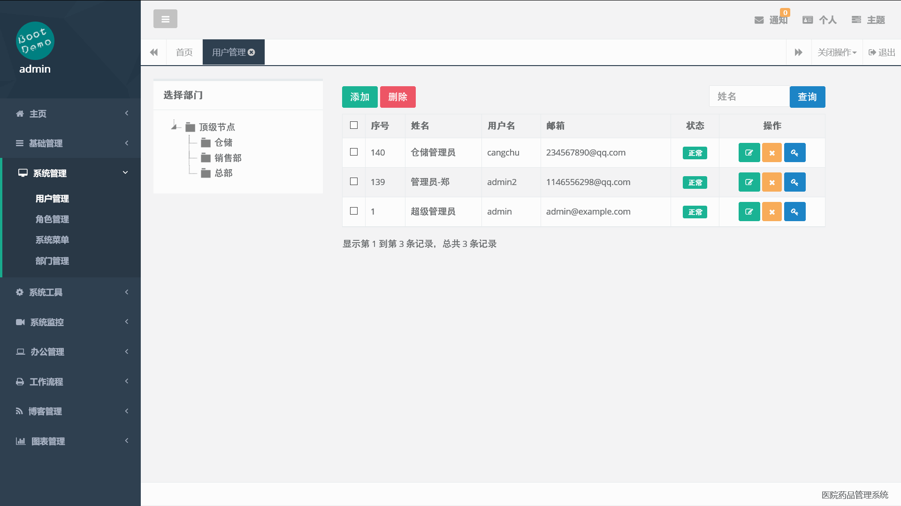
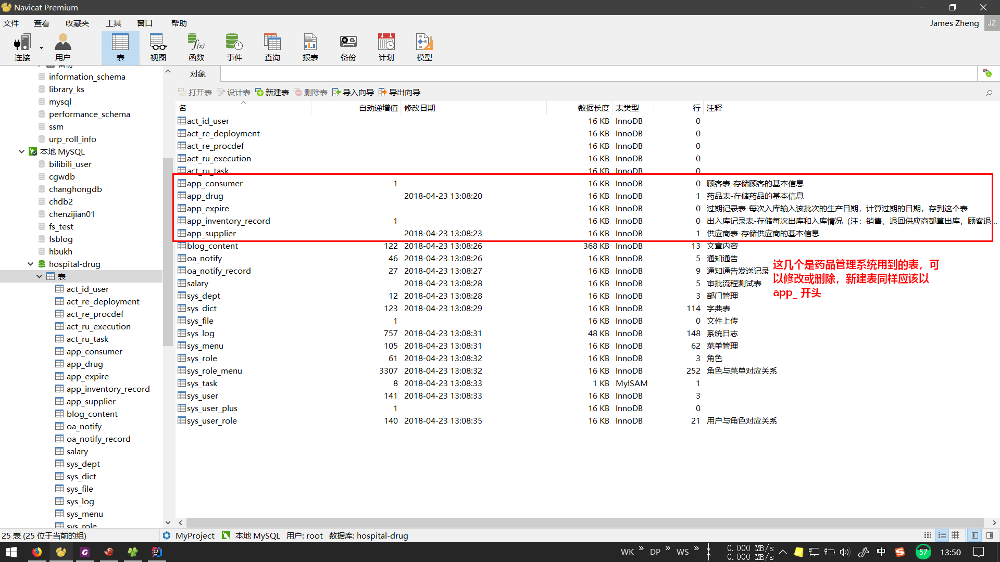

项目线上地址：http://hospital.letec.top

# 截图

# 环境

开发工具：IntelliJ IDEA

数据库：MySQL 5.7

JDK：1.8

构建工具：Maven

版本管理：Git（推荐 GUI 工具：Tortoise Git）

# 开始

- 使用 Git 将仓库 develop 分支克隆到本地
- 安装 JDK, Git, MySQL 
- 打开 IntelliJ IDEA，open existing project 导入项目
- 运行 me.zbl.HospitalApplication
- 浏览器访问 http://localhost:8086
- 系统登录：用户名 admin，密码 123456

# 开发

- 本地新建分支并命名为自己的名字，切换到新建分支
- 一切修改都要在自己新建的分支上进行！！！修改后提交并推送到码云仓库
- 代码编写并测试无误后，到码云上提交 pull request，源分支为自己的分支，目标分支为 develop

# 其他

- 数据库 IP：47.93.187.44，端口 3306
- 数据库用户名：dev，密码：19961120，该用户目前权限有：SELECT, INSERT, UPDATE, DELETE, CREATE, ALTER, DROP
- 运行时使用的数据库在服务器上，因此必须在有网络的环境中调试运行
- IDEA 激活可以使用我的 License Server，地址：http://jetbrains.letec.top
- 药品管理系统用到的表前缀为：app_，其他前缀的表为项目必须，但系统非必须，无需修改
- 新增数据表以前缀 app_ 开头，避免与其他表表淆
- act_ 前缀的 25 个表为 druid 运行时自动生成的，可以忽略，系统框架用得到的表共 20 个
- 目前服务器上的数据库结构是我的设计，可以使用任意 GUI 工具（推荐使用 Navicat）查看、修改或新建表
- 系统使用的 ORM 框架为 MyBatis，可以使用 Spring Data JPA

# 可能有用的东西

- [Building an Application with Spring Boot](https://spring.io/guides/gs/spring-boot/)
- [Serving Web Content with Spring MVC](https://spring.io/guides/gs/serving-web-content/)
- [Spring Data JPA Guide](https://spring.io/guides/gs/accessing-data-jpa/)
- [码云平台帮助文档](http://git.mydoc.io/)
